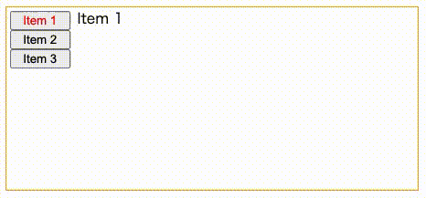

# react-anchor-scroll

- メニューのクリックで特定の位置までスクロールする
- スクロール位置によってメニューの選択状態が追従する



## サンプル(App.tsx)

```tsx
import React from "react";

import { AnchorScrollContext, AnchorScrollMenus, AnchorScrollArea, AnchorScrollElement } from "anchorscroll";

const App = () => {
  const [selectedIndex, setSelectedMenu] = React.useState(0);
  const elementsLength = 3;
  const toSelectedButtonStyle = React.useCallback(
    (index: number) => ({ color: selectedIndex === index ? "red" : undefined }),
    [selectedIndex]
  );
  return (
    <div style={{ display: "flex", height: "200px", margin: "16px", border: "1px solid orange" }}>
      <AnchorScrollContext elementsLength={elementsLength} setSelectedIndex={setSelectedMenu}>
        <AnchorScrollMenus
          render={(onClickMenu) => (
            <div style={{ display: "flex", flexDirection: "column", width: "80px", padding: "4px" }}>
              <button onClick={() => onClickMenu(0)} style={toSelectedButtonStyle(0)}>
                Item 1
              </button>
              <button onClick={() => onClickMenu(1)} style={toSelectedButtonStyle(1)}>
                Item 2
              </button>
              <button onClick={() => onClickMenu(2)} style={toSelectedButtonStyle(2)}>
                Item 3
              </button>
            </div>
          )}
        />
        <AnchorScrollArea style={{ width: "100%", margin: "0px 4px", overflowY: "auto" }}>
          <AnchorScrollElement index={0} style={{ height: 200 }}>
            Item 1
          </AnchorScrollElement>
          <AnchorScrollElement index={1} style={{ height: 200 }}>
            Item 2
          </AnchorScrollElement>
          <AnchorScrollElement index={2} style={{ height: 200 }}>
            Item 3
          </AnchorScrollElement>
        </AnchorScrollArea>
      </AnchorScrollContext>
    </div>
  );
};

export default App;
```

## 参考文献

- Element.scrollIntoView(): https://developer.mozilla.org/ja/docs/Web/API/Element/scrollIntoView
- 交差オブザーバー API: https://developer.mozilla.org/ja/docs/Web/API/Intersection_Observer_API
- JSでのスクロール連動エフェクトにはIntersection Observerが便利: https://ics.media/entry/190902/
- Create React App: https://create-react-app.dev/